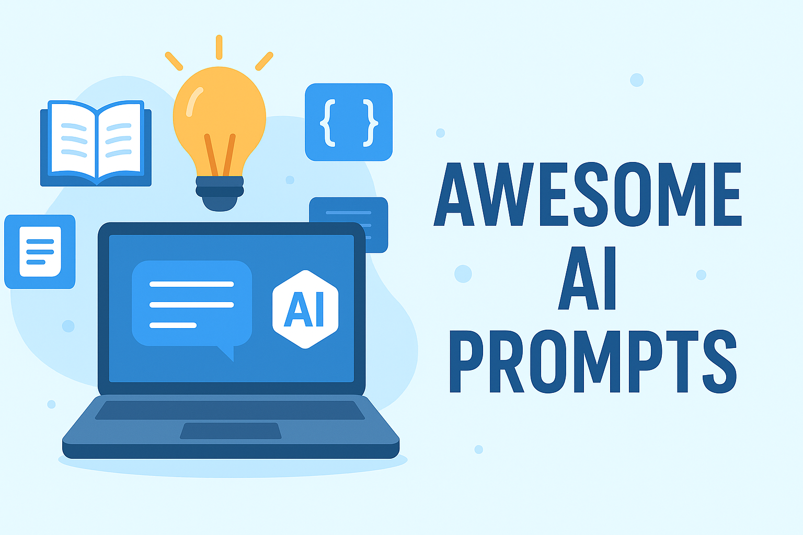
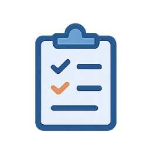
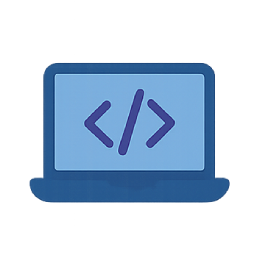
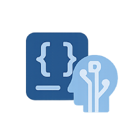

  

# 🌟 Awesome General AI Prompts

A curated collection of **high-quality prompts for general AI tools** covering productivity, coding, learning, writing, marketing, business, research, and JSON prompting.

This project is **open-source** under the MIT license and welcomes contributions from the community.

---

## 📂 Categories

| Productivity      | Coding            | Learning          | Writing           | Marketing         | Business          | Research          | JSON Prompting    |
|:-----------------:|:----------------:|:----------------:|:----------------:|:----------------:|:----------------:|:----------------:|:----------------:|
| 

 | 

 | 

 | 

 | 

 | 

 | 

 | 

 |
| [Productivity](prompts/productivity.md) | [Coding](prompts/coding.md) | [Learning](prompts/learning.md) | [Writing](prompts/writing.md) | [Marketing](prompts/marketing.md) | [Business](prompts/business.md) | [Research](prompts/research.md) | [JSON Prompting](prompts/json.md) |

---

## 🤖 AI Tools

Check out **[AI-TOOLS.md](AI-TOOLS.md)** for a list of free and paid AI tools that work well with these prompts.

---

## 🚀 How to Use

1. Browse the `prompts/` folder.  
2. Copy & paste prompts into your favorite AI tool.  
3. Replace placeholders (`{topic}`, `{text}`, `{code}`) with your own content.  
4. Experiment and share improvements!  

---

## 🤝 Contributing

We welcome contributions!  

1. Fork the repo  
2. Add your prompts in the corresponding category in `prompts/`  
3. Submit a pull request  

Please follow the existing format to keep everything organized.

---

## 📜 License

This project is licensed under the **MIT License** – free for personal and commercial use.

---

⭐ If you find this useful, **give it a star** and share it with the community!
